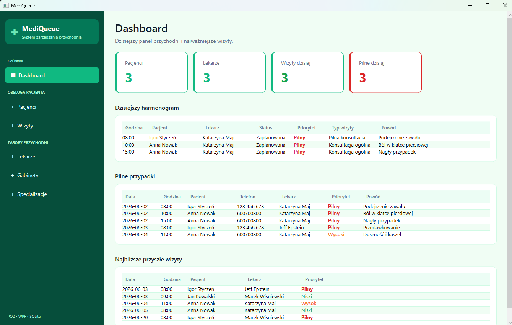
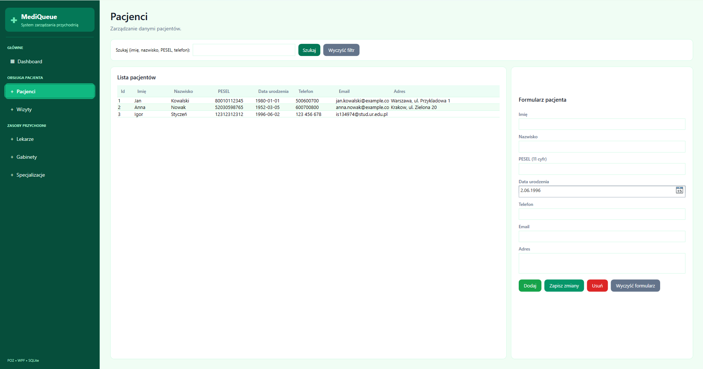
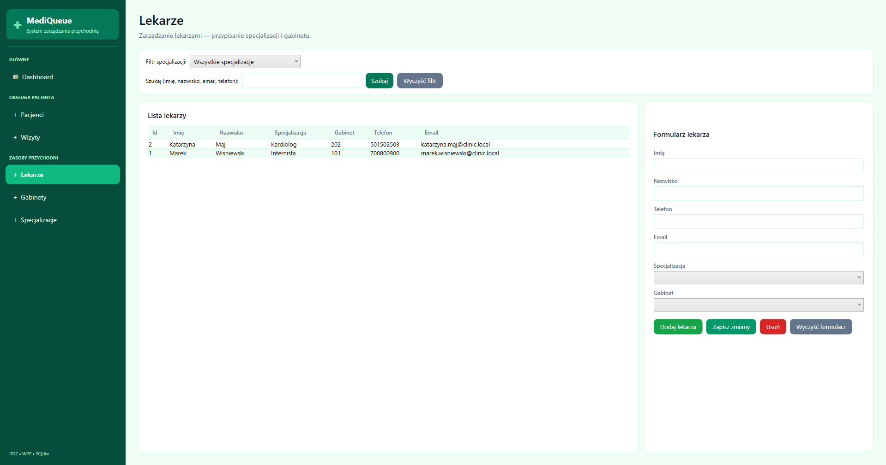
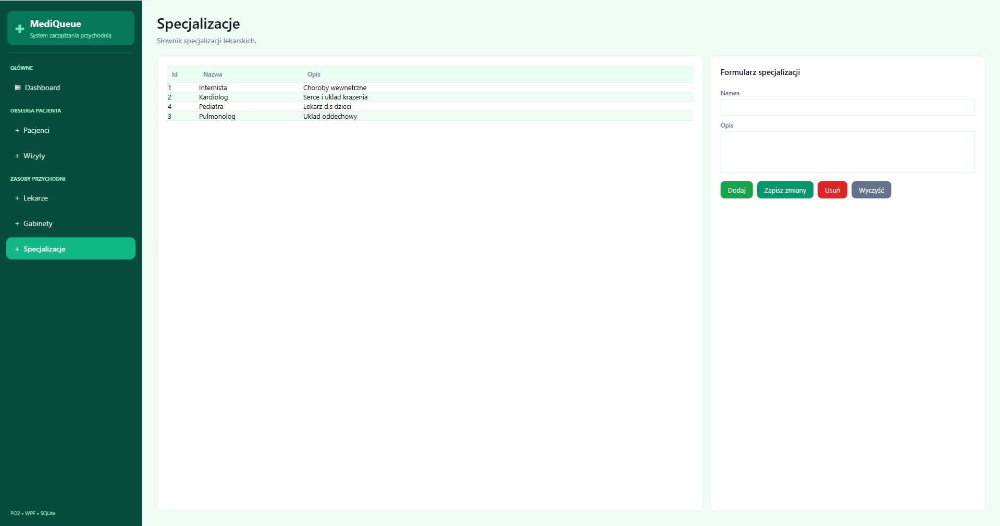
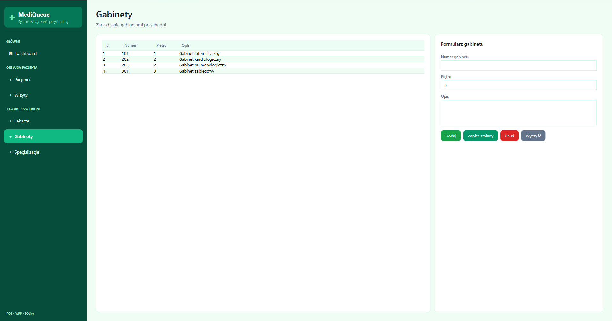
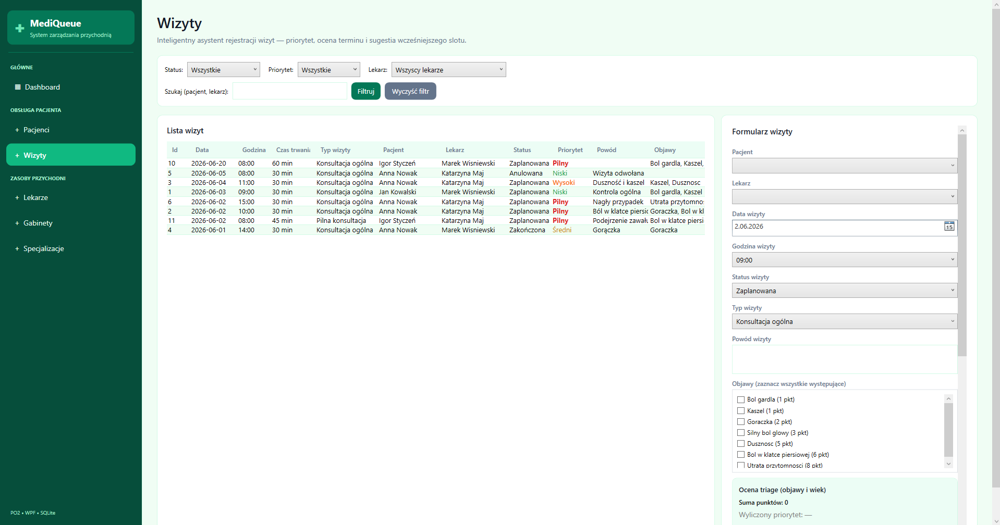
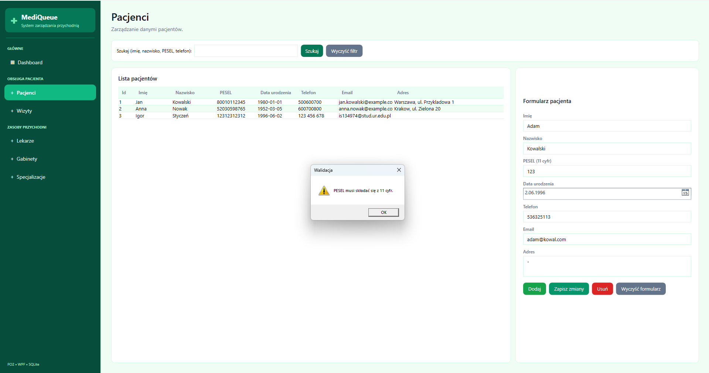
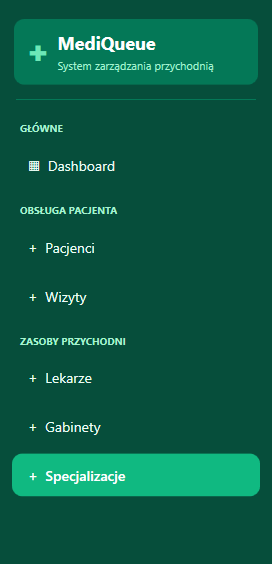

<div align="center">

# MediQueue

### System zarządzania przychodnią lekarską

**Autor:** Igor Styczeń

| | |
|---|---|
| C# | główny język programowania |
| .NET 8 | środowisko uruchomieniowe projektu |
| WPF | stworzenie graficznego interfejsu aplikacji desktopowej |
| Entity Framework Core | obsługa bazy danych z poziomu kodu |
| SQLite | lokalna baza danych zapisywana w pliku `clinic.db` |
| LINQ | filtrowanie i wyszukiwanie danych |
| XAML | opis wyglądu okien i widoków aplikacji |

Projekt jest aplikacją desktopową, więc nie działa w przeglądarce i nie wymaga serwera WWW.

---

## 4. Wymagania do uruchomienia

Do uruchomienia projektu potrzebne są:

| Wymaganie | Opis |
|---|---|
| System | Windows 10 lub Windows 11 |
| .NET SDK | wersja 8.0 lub nowsza |
| Edytor | Visual Studio 2022 albo Visual Studio Code |
| Baza danych | SQLite, tworzona automatycznie przez aplikację |
| Git | opcjonalnie, jeśli projekt jest pobierany z repozytorium |

Aplikacja nie wymaga internetu, kont użytkowników ani żadnych kluczy API.

---

## 5. Uruchomienie projektu

### Pobranie projektu

Jeśli projekt znajduje się na GitHubie:

```bash
git clone https://github.com/TWOJ-LOGIN/ClinicQueueManager.git
cd ClinicQueueManager
```

(Zamień adres na właściwy link, jeśli projekt jest na GitHubie.)

Jeśli projekt jest przekazany jako ZIP, wystarczy go rozpakować do wybranego folderu.

### Przywrócenie paczek NuGet

```bash
dotnet restore
```

### Kompilacja projektu

```bash
dotnet build
```

### Uruchomienie aplikacji

```bash
dotnet run
```

Po uruchomieniu otwiera się okno aplikacji WPF. Program nie posiada adresu URL, ponieważ nie jest aplikacją webową.

---

## 6. Baza danych

Aplikacja korzysta z lokalnej bazy SQLite. Plik bazy danych nazywa się:

```txt
clinic.db
```

Baza jest tworzona automatycznie przy pierwszym uruchomieniu aplikacji. Nie trzeba ręcznie instalować serwera bazy danych.

Przy starcie aplikacji wykonywane są następujące rzeczy:
1. Sprawdzenie, czy baza danych istnieje.
2. Utworzenie tabel, jeśli ich jeszcze nie ma.
3. Dodanie przykładowych danych, jeśli tabele są puste.

W projekcie są przykładowe dane, między innymi:
- pacjenci,
- lekarze,
- specjalizacje,
- gabinety,
- objawy,
- przykładowe wizyty.

---

## 7. Główne moduły aplikacji

### Dashboard

Dashboard jest ekranem startowym aplikacji. Pokazuje najważniejsze informacje dla recepcji.

Na dashboardzie znajdują się:
- liczba pacjentów,
- liczba lekarzy,
- liczba wizyt zaplanowanych na dzisiaj,
- liczba pilnych wizyt na dzisiaj,
- dzisiejszy harmonogram,
- lista pilnych przypadków,
- najbliższe przyszłe wizyty.

Dashboard został ustawiony głównie pod bieżący dzień pracy, ponieważ recepcja najczęściej potrzebuje szybkiego podglądu tego, co dzieje się dzisiaj.



---

### Pacjenci

Moduł pacjentów pozwala dodawać, edytować, usuwać i wyszukiwać pacjentów.

Dane pacjenta:
- imię,
- nazwisko,
- PESEL,
- data urodzenia,
- telefon,
- e-mail,
- adres.

Formularz posiada walidację. Program sprawdza między innymi:
- czy imię i nazwisko nie są puste,
- czy PESEL ma 11 cyfr,
- czy PESEL nie powtarza się w bazie,
- czy data urodzenia nie jest z przyszłości,
- czy e-mail ma poprawny format,
- czy telefon zawiera dozwolone znaki.

Jeśli dane są błędne, aplikacja pokazuje komunikat i nie zapisuje formularza.



---

### Lekarze

Moduł lekarzy służy do zarządzania listą lekarzy pracujących w przychodni.

Dane lekarza:
- imię,
- nazwisko,
- telefon,
- e-mail,
- specjalizacja,
- gabinet.

Lekarz musi mieć przypisaną specjalizację i gabinet. W tabeli wyświetlane są normalne nazwy, a nie same identyfikatory z bazy.

W module lekarzy można też filtrować dane po:
- imieniu,
- nazwisku,
- e-mailu,
- telefonie,
- specjalizacji.

Usunięcie lekarza jest blokowane, jeśli ma on przypisane wizyty. Dzięki temu nie powstają błędy w historii wizyt.



---

### Specjalizacje

Ten moduł jest prostym słownikiem specjalizacji lekarskich. Można dodawać, edytować i usuwać specjalizacje.

Przykłady specjalizacji:
- Internista,
- Kardiolog,
- Dermatolog,
- Pediatra.

Nazwa specjalizacji musi być unikalna. Jeśli specjalizacja jest przypisana do lekarza, system nie pozwala jej usunąć.



---

### Gabinety

Moduł gabinetów pozwala zarządzać pomieszczeniami w przychodni.

Dane gabinetu:
- numer gabinetu,
- piętro,
- opis.

Numer gabinetu musi być unikalny. Piętro powinno być liczbą całkowitą. Jeżeli gabinet jest przypisany do lekarza, nie można go usunąć.



---

### Wizyty

Moduł wizyt jest najważniejszą częścią aplikacji. Pozwala zaplanować wizytę pacjenta u wybranego lekarza.

Podczas dodawania wizyty należy wybrać:
- pacjenta,
- lekarza,
- datę,
- godzinę,
- status,
- objawy,
- typ wizyty,
- czas trwania,
- powód wizyty.

Status wizyty może mieć jedną z wartości:
- Zaplanowana,
- Zakończona,
- Anulowana.

Wizyty można filtrować po statusie, priorytecie, lekarzu oraz po tekście.



---

## 8. Priorytet wizyty

W aplikacji dodany jest prosty mechanizm triage, czyli ustalania pilności wizyty. Priorytet jest liczony na podstawie zaznaczonych objawów i wieku pacjenta.

Każdy objaw ma przypisaną liczbę punktów. Jeśli pacjent ma więcej niż 65 lat, system dodaje dodatkowe 2 punkty.

| Suma punktów | Priorytet |
|---|---|
| 0–2 | Niski |
| 3–5 | Średni |
| 6–8 | Wysoki |
| 9 lub więcej | Pilny |

Dzięki temu recepcja może szybciej zauważyć poważniejsze przypadki. Priorytet jest widoczny w tabeli wizyt oraz na dashboardzie.

---

## 9. Typ wizyty i sugerowany czas

W projekcie dodano typy wizyt, ponieważ różne wizyty trwają różną ilość czasu. Przykładowo wypisanie recepty trwa krócej niż zabieg.

| Typ wizyty | Sugerowany czas |
|---|---|
| Kontrola | 15 min |
| Wypisanie recepty | 15 min |
| Szczepienie | 15 min |
| Konsultacja ogólna | 30 min |
| Badanie | 30 min |
| Pierwsza wizyta | 45 min |
| Pilna konsultacja | 45 min |
| Zabieg | 60 min |

Przycisk „Użyj sugerowanego czasu” uzupełnia czas wizyty zgodnie z wybranym typem. Nie zapisuje jednak wizyty automatycznie, tylko pomaga szybciej wypełnić formularz.

---

## 10. Sprawdzanie konfliktów terminów

Jednym z ważniejszych elementów projektu jest sprawdzanie, czy lekarz nie ma już wizyty w danym czasie.

Na początku najprostszym pomysłem było sprawdzanie tylko identycznej godziny rozpoczęcia wizyty. To jednak nie wystarcza, bo przykładowo:

```txt
Wizyta 1: 10:30–11:00
Wizyta 2: 10:45–11:15
```

Te wizyty zaczynają się o innej godzinie, ale nadal na siebie nachodzą.

Dlatego w projekcie zastosowano sprawdzanie całych przedziałów czasowych. Program porównuje godzinę rozpoczęcia i zakończenia wizyty. Jeśli przedziały się nakładają, zapis zostaje zablokowany.

Przykład dozwolony:

```txt
Wizyta 1: 10:30–11:00
Wizyta 2: 11:00–11:30
```

Tutaj druga wizyta zaczyna się dokładnie po zakończeniu pierwszej, więc nie ma konfliktu.

---

## 11. Walidacja formularzy

W aplikacji dodano walidację, żeby użytkownik nie mógł wpisać przypadkowych lub błędnych danych.

Najważniejsze przykłady walidacji:

| Formularz | Sprawdzane dane |
|---|---|
| Pacjent | PESEL, e-mail, telefon, data urodzenia |
| Lekarz | wymagane pola, e-mail, telefon, specjalizacja, gabinet |
| Wizyta | pacjent, lekarz, data, godzina, powód, konflikt terminu |
| Specjalizacja | pusta nazwa, duplikat nazwy |
| Gabinet | numer gabinetu, piętro, duplikat numeru |

Jeśli formularz zawiera błąd, aplikacja pokazuje komunikat. Dane nie są wtedy zapisywane do bazy.



---

## 12. Dane przechowywane w systemie

| Obszar | Dane |
|---|---|
| Pacjent | imię, nazwisko, PESEL, data urodzenia, telefon, e-mail, adres |
| Lekarz | imię, nazwisko, telefon, e-mail, specjalizacja, gabinet |
| Wizyta | pacjent, lekarz, data, godzina, status, powód, priorytet, typ, czas trwania |
| Specjalizacja | nazwa specjalizacji |
| Gabinet | numer, piętro, opis |
| Objawy | nazwa objawu i liczba punktów |

Wszystkie dane są zapisane lokalnie w pliku `clinic.db`.

---

## 13. Opis interfejsu

Aplikacja posiada menu boczne po lewej stronie. Z tego miejsca można przejść do wszystkich modułów:

- Dashboard,
- Pacjenci,
- Lekarze,
- Wizyty,
- Specjalizacje,
- Gabinety.



Widoki są zbudowane w podobny sposób. Z lewej lub środkowej części ekranu znajduje się tabela danych, a po prawej formularz do dodawania i edycji.

Dzięki temu użytkownik nie musi otwierać wielu osobnych okien. Większość operacji można wykonać w jednym widoku.

---

## 14. Responsywność i wygląd

Projekt jest aplikacją desktopową, więc nie posiada klasycznej responsywności jak strony internetowe. Okno ma ustawiony minimalny rozmiar, żeby formularze i tabele były czytelne.

Na mniejszych ekranach może pojawić się przewijanie. Aplikacja jest przeznaczona głównie do pracy na komputerze lub laptopie w recepcji.

Minimalny zalecany rozmiar ekranu to około 1280×720, a wygodniejszy 1366×768 lub większy.

---

## 15. Najważniejsze pliki i foldery

| Plik/folder | Opis |
|---|---|
| `App.xaml.cs` | start aplikacji, tworzenie bazy i seed danych |
| `Data/AppDbContext.cs` | konfiguracja Entity Framework i SQLite |
| `Models/` | klasy reprezentujące dane, np. pacjent, lekarz, wizyta |
| `Views/` | widoki aplikacji WPF |
| `Helpers/ValidationHelper.cs` | walidacja danych |
| `Services/PriorityCalculatorService.cs` | liczenie priorytetu wizyty |
| `Helpers/AppointmentSchedulingHelper.cs` | sprawdzanie kolizji terminów |
| `Data/DatabaseSeeder.cs` | przykładowe dane startowe |

---

## 16. Problemy napotkane podczas pracy

Podczas tworzenia projektu pojawiło się kilka problemów.

Pierwszym problemem było poprawne sprawdzanie konfliktów terminów. Samo porównanie godziny rozpoczęcia było za słabe, bo wizyty mogą mieć różny czas trwania. Rozwiązaniem było porównywanie całych przedziałów czasu.

Drugim problemem była walidacja formularzy. Trzeba było zabezpieczyć aplikację przed wpisaniem błędnych danych, np. zbyt krótkiego PESEL-u, pustego nazwiska albo niepoprawnego adresu e-mail.

Kolejną rzeczą było odświeżanie dashboardu po zmianie wizyt. Po dodaniu lub edycji wizyty dashboard powinien od razu pokazywać aktualne dane. Do tego wykorzystano mechanizm informowania aplikacji o zmianach w wizytach.

W projekcie trzeba było też uważać na relacje w bazie, np. żeby nie usunąć lekarza, który ma już przypisane wizyty.

---

## 17. Testowanie aplikacji

Szczegółowy opis testów: plik **`TESTY.md`** w katalogu projektu.

Aplikację testowano ręcznie, przechodząc przez główne funkcje programu.

Sprawdzone przypadki:
- dodanie pacjenta z poprawnymi danymi,
- próba dodania pacjenta z błędnym PESEL-em,
- próba dodania pacjenta z takim samym PESEL-em,
- dodanie lekarza ze specjalizacją i gabinetem,
- dodanie wizyty dla pacjenta,
- próba dodania dwóch wizyt u tego samego lekarza w nachodzącym czasie,
- zmiana statusu wizyty,
- filtrowanie pacjentów, lekarzy i wizyt,
- sprawdzenie, czy dashboard pokazuje dzisiejsze wizyty,
- próba usunięcia lekarza lub pacjenta powiązanego z wizytą.

Najważniejsze testy pokazały, że aplikacja blokuje błędne dane i chroni przed podstawowymi pomyłkami przy planowaniu wizyt.

---

## 18. Możliwe dalsze rozwinięcie projektu

W przyszłości projekt można rozbudować o:
- logowanie użytkowników,
- role, np. recepcja, lekarz, administrator,
- panel lekarza z jego wizytami,
- drukowanie harmonogramu,
- eksport wizyt do PDF lub Excela,
- powiadomienia SMS lub e-mail,
- kopie zapasowe bazy danych,
- filtr wizyt po zakresie dat,
- wersję sieciową dla kilku stanowisk,
- pełny moduł płatności,
- historię zmian w systemie.

---

## 19. Podsumowanie

MediQueue to prosta aplikacja desktopowa wspierająca pracę recepcji w małej przychodni. Program pozwala zarządzać pacjentami, lekarzami i wizytami oraz pilnuje poprawności wprowadzanych danych.

Najważniejsze funkcje projektu to:
- CRUD pacjentów, lekarzy, specjalizacji i gabinetów,
- planowanie wizyt,
- sprawdzanie konfliktów terminów,
- walidacja formularzy,
- automatyczne wyliczanie priorytetu,
- sugerowanie czasu wizyty,
- dashboard na dzisiejszy dzień.

Projekt spełnia założenia aplikacji desktopowej z bazą danych i pokazuje praktyczne użycie C#, WPF, SQLite oraz Entity Framework Core.
